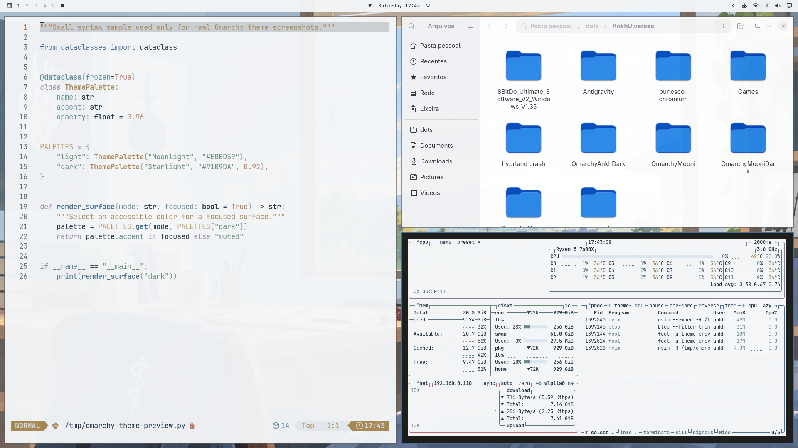
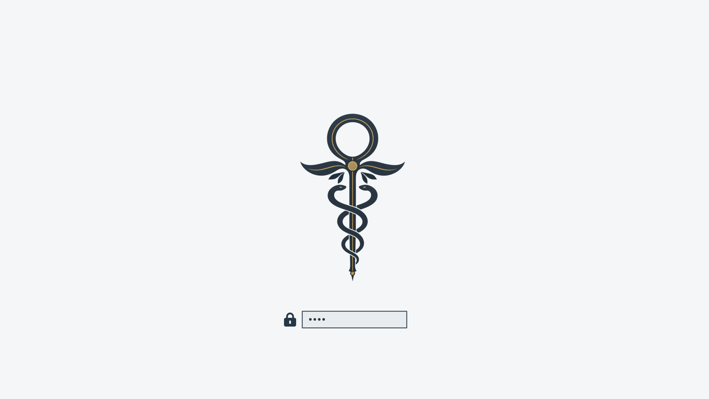

# Omarchy Ankh

Tema claro para Omarchy v4, feito em torno de azul ardósia, neutros frios e os
wallpapers fornecidos para o projeto.

## Instalação

~~~bash
omarchy theme install https://github.com/PedroAugustoOK/omarchy-ankh-theme
omarchy theme set ankh
~~~

Para trocar o wallpaper:

~~~bash
omarchy theme bg next
~~~

A versão escura está em
[Omarchy Ankh Dark](https://github.com/PedroAugustoOK/omarchy-ankh-dark-theme).

## Inclui

- Paleta em colors.toml para Omarchy, terminal, editores e aplicativos
  suportados pelo sistema.
- shell.toml para barra, menus, notificações, polkit, lockscreen e seletor de
  wallpapers.
- Ícones Yaru Blue.
- Tema do btop.
- Quatro wallpapers PNG em 3840×2160.
- Captura real do desktop e prévia fiel do desbloqueio de disco Plymouth.
- Contrato semântico de cores para código em `code-colors.toml`, com temas
  gerados para Zed, Helix e VS Code em `integrations/`.

Os papéis de keywords, funções, tipos, strings, números, comentários e
diagnósticos são compartilhados com Ankh Dark e Mooni. Para regenerar os
arquivos de editor, execute `python3 scripts/generate-code-theme.py`.

## Desbloqueio de disco

`preview-unlock.png` é renderizado com o símbolo `unlock.png`, as cores do tema
e a geometria oficial do Plymouth usada pelo Omarchy.

## Wallpapers

| Arquivo | Cena |
| --- | --- |
| 01-ankh-study.png | Mesa, janela e vegetação |
| 02-ankh-meadow.png | Estudo aberto para o campo |
| 03-ankh-window.png | Mesa clara, caderno e laptop |
| 04-omarchy-wordmark.png | Wordmark oficial em fundo claro |

As notas sobre os assets estão em [ATTRIBUTIONS.md](ATTRIBUTIONS.md).

## Desenvolvimento

~~~bash
python3 scripts/validate-theme.py
~~~

O teste verifica a paleta, contraste, shell, previews e wallpapers.

## Licença

[MIT](LICENSE).

## Arquivos gerados e validação

A identidade do tema vem de `theme.toml`, independentemente do nome da pasta
do clone. `colors.toml` define a paleta; `code-colors.toml` define seus papéis.

`vscode-theme.json` e `helix.toml` na raiz são arquivos somente de cores,
aplicados pela rota padrão do Omarchy. Os equivalentes em `integrations/`
servem para uso independente; Zed continua opcional. Neovim e terminais seguem
os templates do sistema: a cobertura de sintaxe depende também da linguagem,
do parser e do servidor de linguagem, não apenas da paleta.

~~~bash
python3 scripts/generate-code-theme.py
python3 scripts/generate-code-theme.py --check
sh scripts/render-assets.sh
python3 scripts/validate-theme.py
~~~

Os testes conferem saídas desatualizadas, semântica dos editores, contraste de
texto e seleção, além dos arquivos do tema. Não substituem inspeção visual dos
aplicativos abertos. Esta revisão não instala hooks nem recarrega o VS Code.

Veja [REVIEW.md](REVIEW.md) para a comparação com o Omarchy oficial e limites.
